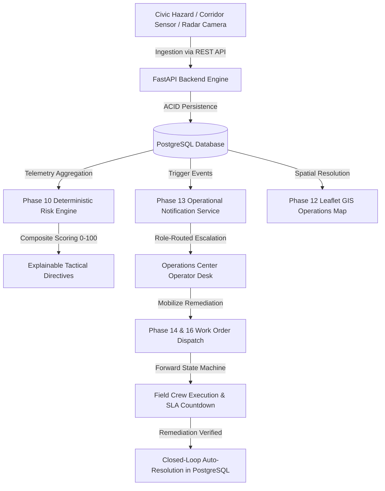
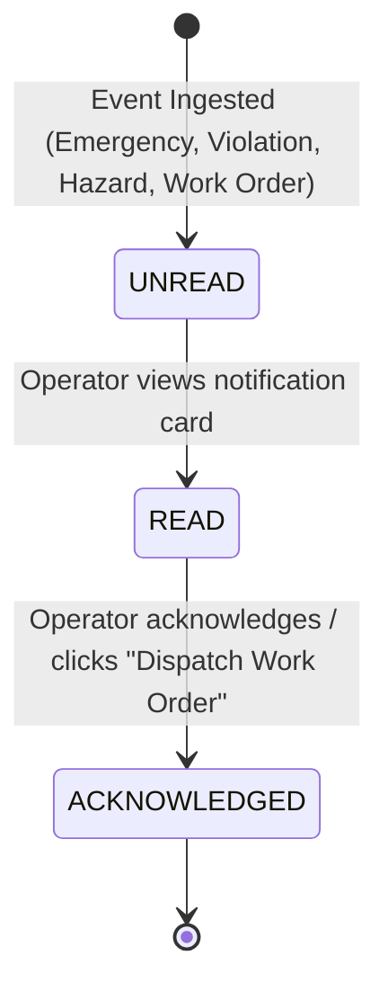
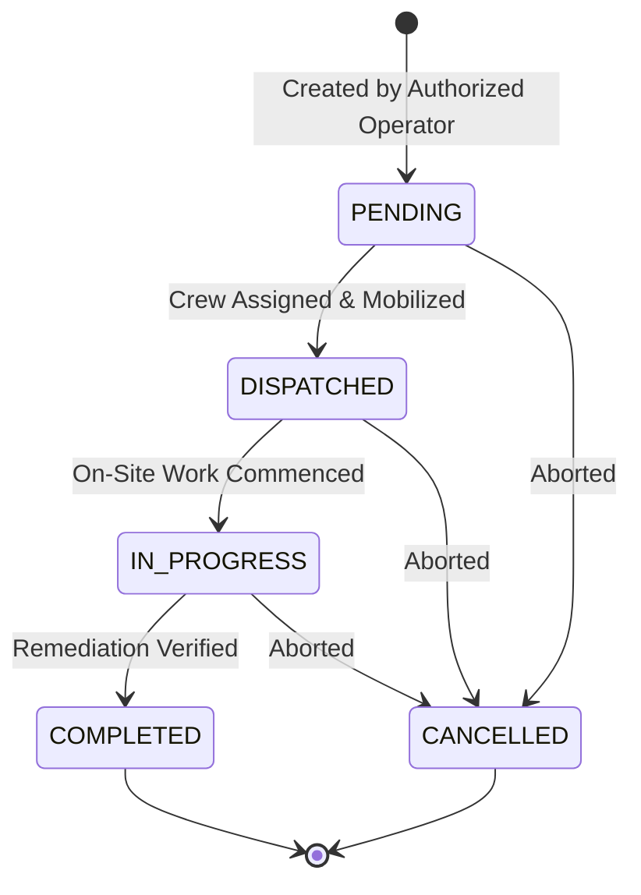
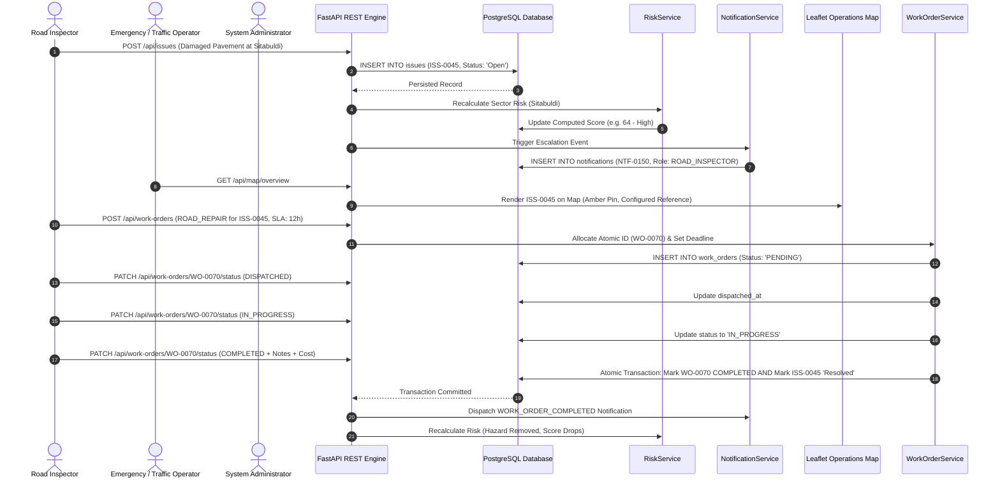

# 🚦 Road System Control — Complete Project & Architecture Documentation

**Document Version:** 1.0.0  
**Current System Status:** Phase 17 Completed  
**Branch:** `develop`  
**Automated Regression Coverage:** 151 / 151 Verified Tests (100% Passing)  
**Database Backend:** PostgreSQL (Raw SQL & SQLAlchemy ORM)  
**API Framework:** FastAPI (Python 3.13)  
**Frontend Client:** Vanilla HTML5 / Modern CSS3 / Vanilla JavaScript (ES6+)  

---

## 1. Project Overview

### 1.1 Project Identity & Purpose
**Road System Control** is a centralized, production-grade municipal traffic intelligence, hazard response, and field operations platform. Developed to replace fragmented, slow-response municipal workflows, it coordinates road incident detection, telemetry monitoring, traffic radar infractions, multi-domain risk intelligence, role-based operational notifications, and closed-loop municipal work order dispatching across a unified control plane.

### 1.2 The Problem Being Addressed
Traditional municipal highway and road administration is inherently **reactive** and **siloed**:
- Potholes, damaged signage, and surface defects linger unaddressed until citizen complaints accumulate.
- Traffic congestion sensors, police speed cameras, and emergency dispatch centers operate on disjointed software with incompatible identifiers.
- Hazard mitigation lacks operational accountability: field remediation crews are dispatched without strict Service Level Agreements (SLAs), and closed-loop verification between field repairs and hazard resolution is absent.
- Critical operations lack deterministic spatial provenance, leading to ungrounded or hallucinated map representations.

### 1.3 Target Operators & Roles
The platform implements strict Role-Based Access Control (RBAC) across four operational user tiers:
1. **`ADMIN` (System Administrator)**: Oversees system health, user provisioning, role assignments, security policies, and has universal oversight across all operational modules.
2. **`TRAFFIC_OPERATOR` (Traffic Desk Operator)**: Monitors real-time corridor flow speeds, congestion classifications, and radar-detected traffic violations.
3. **`EMERGENCY_OPERATOR` (Emergency Incident Dispatcher)**: Broadcasts, monitors, triages, and coordinates high-severity road emergencies (accidents, flash floods, structural collapse).
4. **`ROAD_INSPECTOR` (Civic Infrastructure Inspector)**: Logs physical roadway defects (potholes, structural damage), performs field inspections, and triggers municipal work orders.

### 1.4 Main Operational Workflow


### 1.5 What the System Actually Does
- **Ingests and catalogs** road issues, sensor traffic telemetry, emergency alerts, and radar camera violations.
- **Synthesizes multi-domain data** into deterministic, mathematically bounded risk scores (0–100) across city sectors and arterial corridors without black-box machine learning hallucination.
- **Maintains an offline-capable cartographic operations map** using vendored Leaflet GIS assets, plotting incidents with honest spatial provenance tracking.
- **Routes actionable operational notifications** to designated operator roles with built-in deduplication suppression.
- **Dispatches field work orders** with automated SLA deadline tracking, assigned crews, forward lifecycle controls, and atomic auto-resolution of originating hazards.
- **Provides administrator governance** with self-deactivation protection, last-administrator demotion defense, and credential security.

### 1.6 Current Implementation Status
Phases 1 through 17 are fully implemented, verified, and operational against a live PostgreSQL database on branch `develop`. All 151 automated tests pass across 12 distinct verification suites without regression.

---

## 2. System Objectives

- **Operational Objectives**: Eliminate cross-department latency by unifying traffic telemetry, road safety issues, camera infractions, and emergency alerts onto an authoritative relational backbone.
- **Monitoring Objectives**: Provide second-by-second visibility into arterial highway speeds, vehicle volumes, and congestion ratings with guarded polling and zero UI flicker.
- **Incident Management Objectives**: Enforce forward-only lifecycle state machines for emergencies and field work orders, preventing invalid jumps or backward status mutations.
- **GIS Objectives**: Deliver a 100% offline-capable Leaflet GIS canvas with vector marker clustering, tactical drawer telemetry, and honest spatial provenance tagging.
- **Risk/Intelligence Objectives**: Compute transparent, explainable 0–100 risk scores based on verifiable operational data with complete factor attribution.
- **Notification Objectives**: Prevent operator notification fatigue via duplicate suppression for active entities while guaranteeing role-routed delivery.
- **Work-Order Objectives**: Enforce deterministic SLA deadlines, crew assignment, and atomic transactional auto-resolution of originating issues upon repair completion.
- **Administration & RBAC Objectives**: Secure administrative endpoints with bcrypt password hashing, JWT bearer tokens, last-admin demotion blocks, and self-deactivation prevention.

---

## 3. Technology Stack

### 3.1 Backend Architecture
- **Language / Runtime**: Python 3.13
- **Web API Framework**: FastAPI 0.115+ (ASGI via Starlette & Uvicorn)
- **Database Engine**: PostgreSQL 15+ / 16+
- **Object Relational Mapper (ORM)**: SQLAlchemy 2.0+
- **Data Validation & Schemas**: Pydantic V2 (`BaseModel`, `field_validator`, `model_validator`)
- **Authentication & Security**:
  - `python-jose` / `pyjwt` (HMAC-SHA256 JWT token generation and claims resolution)
  - `passlib[bcrypt]` (Bcrypt password hashing)
  - `email-validator` (RFC-compliant email syntax validation)
- **Asynchronous Server**: `uvicorn` (ASGI worker model)

### 3.2 Frontend Architecture
- **Markup**: HTML5 (Semantic, accessible layout)
- **Styling**: Vanilla CSS3 (Custom design system, CSS variables, glassmorphic panels, dark mode, responsive flex/grid)
- **Scripting**: Vanilla JavaScript (ES6+, modern `fetch()` API, zero heavy framework overhead)
- **GIS Mapping Engine**: Leaflet 1.9.4 (100% vendored locally in `frontend/vendor/leaflet/` with zero external CDN dependencies)
- **Local Development Server**: Python built-in `http.server` (Port 5500)

### 3.3 Testing & Quality Assurance
- **HTTP Client Testing**: `starlette.testclient.TestClient` / `httpx`
- **Database Fixtures**: Dedicated PostgreSQL sessions with isolation, automatic cleanup, and rollback guards
- **Syntax & Linter Validation**: Node.js AST parser (`node -c frontend/script.js`)
- **Regression Framework**: 12 custom modular test suites (`test_phase4.py` through `test_phase17.py`)

### 3.4 Version Control & Environment
- **VCS**: Git (Active branch: `develop`)
- **Configuration**: Twelve-Factor `.env` file management with `.env.example` template

---

## 4. System Architecture

### 4.1 Layered Architectural Diagram
```mermaid
graph TD
    subgraph Client Tier
        UI[Vanilla HTML5 / CSS3 / ES6 Frontend]
        GIS_Engine[Vendored Leaflet 1.9.4 GIS Canvas]
    end

    subgraph API Gateway & Security
        CORS[CORS Middleware]
        JWT_Dep[JWT Bearer Auth Dependency]
        RBAC_Dep[Role-Based Access Control Guards]
    end

    subgraph FastAPI Router Layer
        R_Auth[/api/auth]
        R_Admin[/api/admin/users]
        R_Issues[/api/issues]
        R_Traffic[/api/traffic]
        R_Emerg[/api/emergency-alerts]
        R_Vio[/api/traffic-violations]
        R_Risk[/api/risk]
        R_Map[/api/map]
        R_Notif[/api/notifications]
        R_WO[/api/work-orders]
        R_Analytics[/api/analytics]
    end

    subgraph Service & Intelligence Tier
        S_Auth[AuthService - Bcrypt & JWT]
        S_Risk[RiskService - Deterministic Multi-Domain Risk]
        S_Map[MapService - Spatial Provenance & Municipal Registry]
        S_Notif[NotificationService - Deduplication & Role Routing]
        S_WO[WorkOrderService - SLA Engine & State Machine]
        S_Analytics[AnalyticsService - Cross-Domain Aggregation]
    end

    subgraph Data Access Tier
        ORM[SQLAlchemy 2.0 ORM Session]
        Seq_WO[Sequence: work_order_id_seq]
        Seq_Notif[Sequence: notification_id_seq]
    end

    subgraph Database Tier
        DB[(PostgreSQL Relational Storage)]
    end

    UI --> CORS
    CORS --> JWT_Dep
    JWT_Dep --> RBAC_Dep
    RBAC_Dep --> R_Auth & R_Admin & R_Issues & R_Traffic & R_Emerg & R_Vio & R_Risk & R_Map & R_Notif & R_WO & R_Analytics

    R_Auth --> S_Auth
    R_Admin --> S_Auth
    R_Risk --> S_Risk
    R_Map --> S_Map
    R_Notif --> S_Notif
    R_WO --> S_WO
    R_Analytics --> S_Analytics

    S_Auth & S_Risk & S_Map & S_Notif & S_WO & S_Analytics --> ORM
    ORM --> Seq_WO & Seq_Notif --> DB
```

### 4.2 End-to-End Component Reuse
A core architectural principle of Road System Control is **zero code and calculation duplication**:
- **Authentication**: Phase 11 JWT and RBAC dependencies (`require_admin`, `require_roles`, `get_current_active_user`) are reused directly by Phase 14 Work Orders and Phase 17 System Administration.
- **Risk Calculations**: Phase 10 `RiskService` is the single authoritative calculation engine. It is reused by Phase 12 GIS map polygons, Phase 13 notification triggers, and Phase 14 work order priority validations without duplication.
- **Spatial Resolution**: Phase 12 `MapService.resolve_coordinates()` serves as the central coordinate resolver for issues, traffic corridors, emergencies, radar cameras, and field work orders.
- **Notification Escalation**: Phase 13 `NotificationService` handles automated alerting across emergencies, radar violations, risk alerts, and work order dispatch events.

---

## 5. Phase-Wise Development History (Phases 1–17)

| Phase | Title | Core Objective | Implemented Functionality | Tested Scope |
|---|---|---|---|---|
| **Phase 1** | Frontend Foundation | Responsive UI layout & base styles | Municipal dashboard structure, sidebar navigation, modular cards, system status pills | DOM layout & responsive styling |
| **Phase 2** | Road Issue Reporting (Client) | Client-side reporting form | Validation for potholes, signage, signals, and hazards; temporary browser state | Input boundary tests |
| **Phase 3** | FastAPI Backend Foundation | REST API architecture | Initial FastAPI application, CORS configuration, schema validation, in-memory endpoints | Route handling & HTTP status tests |
| **Phase 4** | PostgreSQL Persistence | Permanent ACID storage | PostgreSQL schema migration, SQLAlchemy ORM, sequential ID generation (`ISS-XXXX`) | `test_phase4.py` (9/9 passed) |
| **Phase 5** | Full-Stack Integration | Client-to-database integration | Vanilla JS `fetch()` integration, removal of localStorage, real-time table sync, detail modal | API error handling & table rendering |
| **Phase 6** | Traffic Monitoring | Telemetry ingest & monitoring | Monitored corridor flow speeds, congestion classifications, vehicle counts, aggregate stats (`TRF-XXXX`) | `test_phase6.py` (10/10 passed) |
| **Phase 7** | Emergency Alert Management | Emergency incident dispatch | Multi-severity emergency alert creation (`EMG-XXXX`), status lifecycle (`Active` &rarr; `Investigating` &rarr; `Resolved`) | `test_phase7.py` (12/12 passed) |
| **Phase 8** | Traffic Violations | Automated radar camera tracking | Infraction logging (`VIO-XXXX`), speed/red-light cameras, fine amounts, status progression | `test_phase8.py` (10/10 passed) |
| **Phase 9** | Analytics & Intelligence | Cross-domain analytics engine | Quantitative correlation between congestion, road hazards, camera violations, and emergency alerts | `test_phase9.py` (10/10 passed) |
| **Phase 10** | AI Risk & Incident Intelligence | Explainable multi-domain risk evaluation | Deterministic 0–100 risk scoring formula across sectors and roads, weighted factor breakdown, action directives | `test_phase10.py` (10/10 passed) |
| **Phase 11** | Authentication & RBAC | Operator security & authorization | Bcrypt password hashing, JWT Bearer tokens, roles (`ADMIN`, `TRAFFIC_OPERATOR`, `EMERGENCY_OPERATOR`, `ROAD_INSPECTOR`) | `test_phase11.py` (14/14 passed) |
| **Phase 12** | Interactive GIS Operations Map | Offline geospatial canvas | Vendored Leaflet GIS engine, 5 cross-domain spatial layers, honest spatial provenance model, tactical inspector drawer | `test_phase12.py` (17/17 passed) |
| **Phase 13** | Notifications & Operational Escalation | Role-routed operational alerting | In-system event notifications (`NTF-XXXX`), duplicate suppression, lifecycle (`UNREAD` &rarr; `READ` &rarr; `ACKNOWLEDGED`) | `test_phase13.py` (17/17 passed) |
| **Phase 14** | Field Work Orders Backend | Field dispatch & SLA engine | Concurrency-safe atomic IDs (`WO-XXXX`), deterministic SLA deadlines, forward state machine, closed-loop hazard resolution | `test_phase14.py` (18/18 passed) |
| **Phase 15** | Architectural Validation | Inspection & stabilization | System audit, zero-duplication enforcement, architectural alignment across services | Internal code audit |
| **Phase 16** | Operational Work Order UI | Complete Work Orders frontend | KPI cards, multi-parameter filter toolbar, detailed inspection modal, role-filtered dispatch modal, GIS layer integration | `test_phase16.py` (12/12 passed) |
| **Phase 17** | System Administration & Users | Admin user & role governance | User management API (`/api/admin/users`), role modification, status toggling, self-deactivation & last-admin protection | `test_phase17.py` (12/12 passed) |

---

## 6. Database Documentation

### 6.1 Database Architecture
- **Engine**: PostgreSQL
- **Connection URL**: Configured via `DATABASE_URL` in `.env`
- **ORM**: SQLAlchemy declarative models inheriting from `database.Base`
- **Schema Provisioning**: Automatic startup execution of `Base.metadata.create_all(bind=engine)`, supplemented by custom idempotent schema helpers in `database.py`:
  - `ensure_spatial_columns()`: Dynamically provisions `latitude` and `longitude` (`DOUBLE PRECISION`) across operational tables.
  - `ensure_notification_schema()`: Provisions `notifications` table, `read_by` column, and atomic sequence `notification_id_seq`.
  - `ensure_work_order_schema()`: Provisions `work_orders` table and atomic sequence `work_order_id_seq`.

### 6.2 Table Specifications

#### 1. `users`
Represents platform operators and administrative personnel for authentication and RBAC.
- `id` (Integer, Primary Key, Autoincrement)
- `username` (VARCHAR(50), Unique, Indexed, Not Null)
- `email` (VARCHAR(120), Unique, Indexed, Not Null)
- `password_hash` (VARCHAR(255), Not Null) — Bcrypt encrypted string
- `full_name` (VARCHAR(100), Not Null)
- `role` (VARCHAR(30), Indexed, Not Null, Default: `"ROAD_INSPECTOR"`) — `ADMIN`, `TRAFFIC_OPERATOR`, `EMERGENCY_OPERATOR`, `ROAD_INSPECTOR`
- `is_active` (BOOLEAN, Not Null, Default: `True`)
- `created_at` (TIMESTAMP WITH TIME ZONE, Server Default: `now()`)
- `updated_at` (TIMESTAMP WITH TIME ZONE, Server Default: `now()`, OnUpdate: `now()`)

#### 2. `issues`
Represents physical road defects, structural damage, and surface hazards.
- `id` (VARCHAR(20), Primary Key, Indexed) — Format: `ISS-0001`, `ISS-0002`
- `issue_type` (VARCHAR(100), Indexed, Not Null) — e.g., `Pothole`, `Damaged Road`, `Faded Road Markings`, `Flooding`
- `description` (TEXT, Not Null)
- `location` (VARCHAR(200), Not Null) — Textual corridor/landmark description
- `area` (VARCHAR(100), Indexed, Not Null) — Municipal ward/sector
- `severity` (VARCHAR(20), Not Null) — `Low`, `Medium`, `High`, `Critical`
- `status` (VARCHAR(20), Not Null, Default: `"Open"`) — `Open`, `In Progress`, `Resolved`, `Closed`
- `latitude` (DOUBLE PRECISION, Nullable)
- `longitude` (DOUBLE PRECISION, Nullable)
- `reported_at` (VARCHAR(50), Not Null) — ISO 8601 string
- `created_at` (TIMESTAMP WITH TIME ZONE, Server Default: `now()`)

#### 3. `traffic_records`
Represents real-time telemetry from municipal traffic sensors and flow monitoring points.
- `id` (VARCHAR(20), Primary Key, Indexed) — Format: `TRF-0001`, `TRF-0002`
- `road_name` (VARCHAR(150), Indexed, Not Null) — Monitored corridor name
- `area` (VARCHAR(100), Not Null)
- `vehicle_count` (INTEGER, Not Null, Constraint: `>= 0`)
- `average_speed` (FLOAT, Not Null, Constraint: `>= 0.0`) — Flow speed in km/h
- `congestion_level` (VARCHAR(30), Not Null) — `Low`, `Moderate`, `Heavy`, `Severe`
- `status` (VARCHAR(30), Not Null) — `Clear`, `Moving`, `Congested`, `Blocked`
- `latitude` (DOUBLE PRECISION, Nullable)
- `longitude` (DOUBLE PRECISION, Nullable)
- `recorded_at` (VARCHAR(50), Not Null) — ISO 8601 string
- `created_at` (TIMESTAMP WITH TIME ZONE, Server Default: `now()`)

#### 4. `emergency_alerts`
Represents critical municipal alerts and hazardous incident broadcasts.
- `id` (VARCHAR(20), Primary Key, Indexed) — Format: `EMG-0001`, `EMG-0002`
- `alert_type` (VARCHAR(50), Indexed, Not Null) — `Accident`, `Road Blockage`, `Fire`, `Flooding`, `Medical Emergency`, `Traffic Emergency`
- `title` (VARCHAR(150), Not Null)
- `description` (TEXT, Not Null)
- `location` (VARCHAR(200), Not Null)
- `area` (VARCHAR(100), Not Null)
- `severity` (VARCHAR(20), Not Null) — `Low`, `Medium`, `High`, `Critical`
- `status` (VARCHAR(20), Not Null, Default: `"Active"`) — `Active`, `Investigating`, `Resolved`
- `latitude` (DOUBLE PRECISION, Nullable)
- `longitude` (DOUBLE PRECISION, Nullable)
- `issued_at` (VARCHAR(50), Not Null) — ISO 8601 string
- `created_at` (TIMESTAMP WITH TIME ZONE, Server Default: `now()`)

#### 5. `traffic_violations`
Represents automated camera-detected traffic infractions and speed radar violations.
- `id` (VARCHAR(20), Primary Key, Indexed) — Format: `VIO-0001`, `VIO-0002`
- `violation_type` (VARCHAR(100), Indexed, Not Null) — `Speeding`, `Red Light Violation`, `Wrong Lane Driving`, `Illegal Parking`, `Reckless Driving`
- `vehicle_number` (VARCHAR(20), Indexed, Not Null) — License plate identifier
- `location` (VARCHAR(200), Not Null)
- `area` (VARCHAR(100), Not Null)
- `severity` (VARCHAR(20), Not Null) — `Low`, `Medium`, `High`, `Critical`
- `fine_amount` (FLOAT, Not Null, Constraint: `>= 0.0`) — Penalty in INR
- `status` (VARCHAR(30), Not Null, Default: `"Detected"`) — `Detected`, `Under Review`, `Confirmed`, `Resolved`
- `description` (TEXT, Nullable)
- `latitude` (DOUBLE PRECISION, Nullable)
- `longitude` (DOUBLE PRECISION, Nullable)
- `detected_at` (VARCHAR(50), Not Null) — ISO 8601 string
- `created_at` (TIMESTAMP WITH TIME ZONE, Server Default: `now()`)

#### 6. `notifications`
Represents role-routed operational events and tactical alerts.
- `id` (VARCHAR(20), Primary Key, Indexed) — Format: `NTF-0001`, `NTF-0002` (Allocated via `notification_id_seq`)
- `title` (VARCHAR(200), Not Null)
- `message` (TEXT, Not Null)
- `severity` (VARCHAR(20), Not Null) — `Critical`, `High`, `Medium`, `Low`
- `recipient_role` (VARCHAR(50), Indexed, Not Null) — `ADMIN`, `TRAFFIC_OPERATOR`, `EMERGENCY_OPERATOR`, `ROAD_INSPECTOR`
- `source_domain` (VARCHAR(50), Not Null) — `emergency_alerts`, `traffic`, `traffic_violations`, `issues`, `risk`, `work_orders`
- `source_id` (VARCHAR(50), Indexed, Not Null) — Foreign entity ID reference
- `status` (VARCHAR(20), Indexed, Not Null, Default: `"UNREAD"`) — `UNREAD`, `READ`, `ACKNOWLEDGED`
- `read_by` (VARCHAR(50), Nullable) — Username of operator who read the alert
- `read_at` (TIMESTAMP WITH TIME ZONE, Nullable)
- `acknowledged_at` (TIMESTAMP WITH TIME ZONE, Nullable)
- `created_at` (TIMESTAMP WITH TIME ZONE, Server Default: `now()`)

#### 7. `work_orders`
Represents field remediation dispatch orders, assigned repair crews, and SLA tracking.
- `id` (VARCHAR(20), Primary Key, Indexed) — Format: `WO-0001`, `WO-0002` (Allocated via `work_order_id_seq`)
- `order_type` (VARCHAR(50), Indexed, Not Null) — `ROAD_REPAIR`, `FIELD_INSPECTION`, `EMERGENCY_RESPONSE`, `TRAFFIC_DIVERSION`
- `title` (VARCHAR(200), Not Null)
- `description` (TEXT, Not Null)
- `priority` (VARCHAR(20), Indexed, Not Null) — `Critical`, `High`, `Medium`, `Low`
- `source_domain` (VARCHAR(50), Indexed, Not Null) — `issues`, `emergency_alerts`, `traffic`
- `source_id` (VARCHAR(50), Indexed, Not Null) — Originating entity ID
- `location` (VARCHAR(200), Not Null)
- `area` (VARCHAR(100), Indexed, Not Null)
- `assigned_crew` (VARCHAR(100), Not Null) — Mobilized crew name/unit
- `target_sla_hours` (INTEGER, Not Null) — Approved SLA duration (2, 4, 12, 24, 48, 72 hours)
- `sla_deadline` (TIMESTAMP WITH TIME ZONE, Indexed, Not Null) — `created_at + target_sla_hours`
- `status` (VARCHAR(30), Indexed, Not Null, Default: `"PENDING"`) — `PENDING`, `DISPATCHED`, `IN_PROGRESS`, `COMPLETED`, `CANCELLED`
- `created_by` (VARCHAR(50), Not Null) — Username from authenticated JWT
- `dispatched_at` (TIMESTAMP WITH TIME ZONE, Nullable)
- `completed_at` (TIMESTAMP WITH TIME ZONE, Nullable)
- `completed_by` (VARCHAR(50), Nullable)
- `resolution_notes` (TEXT, Nullable) — Mandatory upon transitioning to `COMPLETED`
- `actual_cost` (FLOAT, Nullable, Constraint: `>= 0.0`)
- `latitude` (DOUBLE PRECISION, Nullable)
- `longitude` (DOUBLE PRECISION, Nullable)
- `coordinate_source` (VARCHAR(50), Not Null, Default: `"unmapped"`)
- `created_at` (TIMESTAMP WITH TIME ZONE, Server Default: `now()`)
- `updated_at` (TIMESTAMP WITH TIME ZONE, Server Default: `now()`, OnUpdate: `now()`)

---

## 7. API Reference

### 7.1 System Health
| Method | Endpoint | Auth / Role | Description | Response Model |
|---|---|---|---|---|
| `GET` | `/api/health` | Public | Service health verification | `{"status": "ok", "service": "road-system-control"}` |

### 7.2 Authentication (`/api/auth`)
| Method | Endpoint | Auth / Role | Description | Status Codes |
|---|---|---|---|---|
| `POST` | `/api/auth/login` | Public | Authenticates credentials, returns signed JWT access token & user profile | 200, 401, 403 |
| `GET` | `/api/auth/me` | Bearer Token (Any Active) | Returns profile of current logged-in user | 200, 401, 403 |
| `POST` | `/api/auth/logout` | Public | Client-side session termination instruction | 200 |
| `GET` | `/api/auth/users` | `ADMIN` only | Lists all operator accounts | 200, 401, 403 |
| `POST` | `/api/auth/users` | `ADMIN` only | Provisions a new operator account | 201, 400, 401, 403, 422 |
| `PATCH`| `/api/auth/users/{user_id}/status` | `ADMIN` only | Updates operator active status | 200, 401, 403, 404 |
| `GET` | `/api/auth/rbac/admin` | `ADMIN` only | Verifies ADMIN access claims | 200, 401, 403 |
| `GET` | `/api/auth/rbac/traffic` | `TRAFFIC_OPERATOR`, `ADMIN` | Verifies traffic access claims | 200, 401, 403 |
| `GET` | `/api/auth/rbac/emergency`| `EMERGENCY_OPERATOR`, `ADMIN` | Verifies emergency access claims | 200, 401, 403 |
| `GET` | `/api/auth/rbac/inspector`| `ROAD_INSPECTOR`, `ADMIN` | Verifies inspector access claims | 200, 401, 403 |

### 7.3 System Administration (`/api/admin/users`) — Phase 17
| Method | Endpoint | Auth / Role | Description | Status Codes |
|---|---|---|---|---|
| `GET` | `/api/admin/users` | `ADMIN` only | Lists system users with `role`, `is_active`, and `search` query parameters | 200, 401, 403 |
| `GET` | `/api/admin/users/{id}` | `ADMIN` only | Retrieves user profile by primary key | 200, 401, 403, 404 |
| `POST` | `/api/admin/users` | `ADMIN` only | Creates user with unique username/email, bcrypt hash, and assigned role | 201, 400, 401, 403, 422 |
| `PATCH`| `/api/admin/users/{id}/role` | `ADMIN` only | Updates user role with last-admin demotion protection | 200, 400, 401, 403, 404, 422 |
| `PATCH`| `/api/admin/users/{id}/status` | `ADMIN` only | Toggles active state with self-deactivation & last-admin protection | 200, 400, 401, 403, 404, 422 |

### 7.4 Road Issues (`/api/issues`)
| Method | Endpoint | Auth / Role | Description | Status Codes |
|---|---|---|---|---|
| `GET` | `/api/issues` | Public / Operator | Retrieves list of issues with optional filtering | 200 |
| `POST` | `/api/issues` | `ROAD_INSPECTOR`, `ADMIN` | Ingests a new road hazard into PostgreSQL (`ISS-XXXX`) | 201, 401, 403, 422 |
| `GET` | `/api/issues/{id}` | Public / Operator | Retrieves single issue details | 200, 404 |

### 7.5 Traffic Telemetry (`/api/traffic`)
| Method | Endpoint | Auth / Role | Description | Status Codes |
|---|---|---|---|---|
| `GET` | `/api/traffic` | Public / Operator | Retrieves monitored traffic corridor records | 200 |
| `GET` | `/api/traffic/summary` | Public / Operator | Retrieves aggregate metrics (total vehicles, average speed, congestion) | 200 |
| `POST` | `/api/traffic` | `TRAFFIC_OPERATOR`, `ADMIN` | Ingests traffic sensor observation (`TRF-XXXX`) | 201, 401, 403, 422 |
| `GET` | `/api/traffic/{id}` | Public / Operator | Retrieves specific traffic observation | 200, 404 |

### 7.6 Emergency Alerts (`/api/emergency-alerts`)
| Method | Endpoint | Auth / Role | Description | Status Codes |
|---|---|---|---|---|
| `GET` | `/api/emergency-alerts` | Public / Operator | Retrieves emergency alerts (optional `?status=` filter) | 200 |
| `GET` | `/api/emergency-alerts/summary` | Public / Operator | Retrieves aggregate alert metrics (active, critical, investigating, resolved) | 200 |
| `POST` | `/api/emergency-alerts` | `EMERGENCY_OPERATOR`, `ADMIN`| Ingests and broadcasts emergency alert (`EMG-XXXX`) | 201, 401, 403, 422 |
| `GET` | `/api/emergency-alerts/{id}` | Public / Operator | Retrieves single alert details | 200, 404 |
| `PATCH`| `/api/emergency-alerts/{id}/status`| `EMERGENCY_OPERATOR`, `ADMIN`| Updates alert status (`Active` &rarr; `Investigating` &rarr; `Resolved`) | 200, 401, 403, 404, 422 |

### 7.7 Traffic Violations (`/api/traffic-violations`)
| Method | Endpoint | Auth / Role | Description | Status Codes |
|---|---|---|---|---|
| `GET` | `/api/traffic-violations` | Public / Operator | Retrieves infractions with filters (`status`, `severity`, `type`, `area`) | 200 |
| `GET` | `/api/traffic-violations/summary`| Public / Operator | Returns violation summary counts and total fine amounts | 200 |
| `POST` | `/api/traffic-violations` | `TRAFFIC_OPERATOR`, `ADMIN` | Ingests radar camera violation (`VIO-XXXX`) | 201, 401, 403, 422 |
| `GET` | `/api/traffic-violations/{id}` | Public / Operator | Retrieves specific violation record | 200, 404 |
| `PATCH`| `/api/traffic-violations/{id}/status`| `TRAFFIC_OPERATOR`, `ADMIN`| Transitions violation status | 200, 401, 403, 404, 422 |

### 7.8 Analytics Engine (`/api/analytics`)
| Method | Endpoint | Auth / Role | Description | Status Codes |
|---|---|---|---|---|
| `GET` | `/api/analytics/overview` | Public / Operator | City-wide operational totals across all 4 domains | 200 |
| `GET` | `/api/analytics/traffic` | Public / Operator | Corridor throughput, speed distributions, congestion rates | 200 |
| `GET` | `/api/analytics/issues` | Public / Operator | Road issue resolution rates, category distributions, severity ratios | 200 |
| `GET` | `/api/analytics/emergencies` | Public / Operator | Emergency frequency breakdown and resolution times | 200 |
| `GET` | `/api/analytics/violations` | Public / Operator | Radar penalty totals, infraction rankings, payment statuses | 200 |
| `GET` | `/api/analytics/trends` | Public / Operator | Longitudinal operational time-series data | 200 |

### 7.9 AI Risk & Incident Intelligence (`/api/risk`) — Phase 10
| Method | Endpoint | Auth / Role | Description | Status Codes |
|---|---|---|---|---|
| `GET` | `/api/risk/overview` | Public / Operator | Consolidated municipal risk score (0–100), composite rating, top hazard sectors | 200 |
| `GET` | `/api/risk/areas` | Public / Operator | Evaluated risk scores for all city municipal wards/sectors | 200 |
| `GET` | `/api/risk/areas/{area_name}` | Public / Operator | Detailed factor breakdown and tactical recommendations for specific ward | 200, 404, 422 |
| `GET` | `/api/risk/roads` | Public / Operator | Evaluated risk scores across monitored highway corridors | 200 |
| `GET` | `/api/risk/roads/{road_name}` | Public / Operator | Detailed factor breakdown for specific corridor | 200, 404, 422 |

### 7.10 Interactive GIS / Operations Map (`/api/map`) — Phase 12
| Method | Endpoint | Auth / Role | Description | Status Codes |
|---|---|---|---|---|
| `GET` | `/api/map/overview` | Public / Operator | Consolidated spatial features across issues, traffic, emergencies, violations, risk | 200, 422 |
| `GET` | `/api/map/work-orders` | Public / Operator | GeoJSON-compatible features for active field work orders | 200 |

### 7.11 Notifications & Escalation (`/api/notifications`) — Phase 13
| Method | Endpoint | Auth / Role | Description | Status Codes |
|---|---|---|---|---|
| `GET` | `/api/notifications` | Bearer Token (Role-Filtered)| Retrieves in-system alerts filtered by authenticated role, status, severity | 200, 401 |
| `GET` | `/api/notifications/summary` | Bearer Token (Role-Filtered)| Returns count of unread, read, acknowledged, and critical notifications | 200, 401 |
| `GET` | `/api/notifications/{id}` | Bearer Token | Retrieves single notification with full entity context | 200, 401, 403, 404 |
| `PATCH`| `/api/notifications/{id}/read` | Bearer Token | Marks notification as READ (`read_at`, `read_by` audit logging) | 200, 401, 403, 404 |
| `PATCH`| `/api/notifications/{id}/acknowledge`| Bearer Token | Acknowledges alert with audit timestamp | 200, 401, 403, 404 |
| `POST` | `/api/notifications/sync` | `ADMIN` only | Evaluates database for unaddressed hazards, dispatching role-routed alerts | 200, 401, 403 |

### 7.12 Field Work Orders (`/api/work-orders`) — Phase 14 & 16
| Method | Endpoint | Auth / Role | Description | Status Codes |
|---|---|---|---|---|
| `GET` | `/api/work-orders` | Bearer Token (Role-Aware)| Paginated work orders with filtering by `status`, `priority`, `order_type`, `area` | 200, 401 |
| `GET` | `/api/work-orders/summary` | Bearer Token | Operational metrics (total, active, completed, SLA breached, expenditure) | 200, 401 |
| `GET` | `/api/work-orders/{id}` | Bearer Token | Single work order with calculated runtime SLA status | 200, 401, 403, 404 |
| `GET` | `/api/work-orders/by-source/{domain}/{source_id}`| Bearer Token | Traces all work orders linked to an operational entity | 200, 401 |
| `POST` | `/api/work-orders` | Permitted Role per Domain | Mobilizes work order with atomic sequence ID and duplicate prevention | 201, 400, 401, 403, 422 |
| `PATCH`| `/api/work-orders/{id}/status` | Permitted Role / ADMIN | Transitions lifecycle status; auto-resolves originating hazard on `COMPLETED` | 200, 400, 401, 403, 404, 422 |

---

## 8. Authentication & Role-Based Access Control (RBAC)

### 8.1 JWT Authentication Flow
1. **Login Request**: Client submits credentials to `POST /api/auth/login`.
2. **Password Verification**: `AuthService.verify_password` compares plaintext against the stored bcrypt hash.
3. **Active Account Check**: If `user.is_active is False`, request is immediately rejected with `403 Forbidden ("Account is deactivated. Contact system administrator.")`.
4. **Token Issuance**: A signed JWT access token is generated via `AuthService.create_access_token` containing:
   - `sub`: Username string
   - `user_id`: Database primary key integer
   - `role`: Canonical role string
   - `iat`: Issue timestamp
   - `exp`: Expiration timestamp (default: 8 hours)
5. **Token Resolution**: Incoming protected requests provide `Authorization: Bearer <token>`. Dependency `get_current_user` decodes claims and verifies signature.
6. **Credential Privacy**: User response schemas (`UserResponse`) never include `password` or `password_hash`.

### 8.2 Role Boundaries & Permissions Matrix

| Endpoint Group | `ADMIN` | `TRAFFIC_OPERATOR` | `EMERGENCY_OPERATOR` | `ROAD_INSPECTOR` | Unauthenticated |
|---|---|---|---|---|---|
| **Public Telemetry / Health** | ✅ Access | ✅ Access | ✅ Access | ✅ Access | ✅ Access |
| **View Issues / Traffic / Alerts / Map** | ✅ Access | ✅ Access | ✅ Access | ✅ Access | ✅ Access |
| **Ingest Road Issues (`POST /api/issues`)** | ✅ Create | ❌ 403 | ❌ 403 | ✅ Create | ❌ 401 |
| **Ingest Traffic Telemetry (`POST /api/traffic`)** | ✅ Create | ✅ Create | ❌ 403 | ❌ 403 | ❌ 401 |
| **Broadcast Alerts (`POST /api/emergency-alerts`)** | ✅ Create | ❌ 403 | ✅ Create | ❌ 403 | ❌ 401 |
| **Log Violations (`POST /api/traffic-violations`)** | ✅ Create | ✅ Create | ❌ 403 | ❌ 403 | ❌ 401 |
| **Work Order: `ROAD_REPAIR` / `INSPECTION`** | ✅ Manage | ❌ 403 | ❌ 403 | ✅ Manage | ❌ 401 |
| **Work Order: `EMERGENCY_RESPONSE`** | ✅ Manage | ❌ 403 | ✅ Manage | ❌ 403 | ❌ 401 |
| **Work Order: `TRAFFIC_DIVERSION`** | ✅ Manage | ✅ Manage | ❌ 403 | ❌ 403 | ❌ 401 |
| **Notifications Feed** | ✅ All Roles | ✅ Traffic Alerts | ✅ Emergency Alerts | ✅ Inspector Alerts | ❌ 401 |
| **System Administration (`/api/admin/users`)** | ✅ Universal | ❌ 403 | ❌ 403 | ❌ 403 | ❌ 401 |

---

## 9. Risk & Incident Intelligence (Phase 10)

### 9.1 Deterministic vs Machine Learning Clarification
> [!IMPORTANT]
> **Methodology Grounding**: Phase 10 implements an **explainable, deterministic mathematical scoring model**, NOT a black-box machine learning model. Because operational databases during initial deployment contain fewer than 10,000 records, statistical ML models would suffer from severe overfitting and hallucinate synthetic probabilities. Every point in the 0–100 risk score is mathematically tied to observable PostgreSQL telemetry.

### 9.2 Mathematical Formulation & Weights
The Composite Municipal Risk Score ($R \in [0, 100]$) is computed by aggregating four domain-weighted scoring functions:

$$R = \min(100.0, \; S_{\text{emergency}} + S_{\text{traffic}} + S_{\text{issues}} + S_{\text{violations}})$$

| Domain Component | Maximum Weight | Calculation Formula & Contributing Factors |
|---|---|---|
| **Emergency Incidents ($S_{\text{emergency}}$)** | **35.0 pts** | - Active Critical Emergency: **+25.0 pts**<br>- Active High Emergency: **+15.0 pts**<br>- Active Medium Emergency: **+8.0 pts**<br>- Active Low Emergency: **+4.0 pts**<br>- Investigating status applies a 50% factor. |
| **Traffic Flow Deficits ($S_{\text{traffic}}$)** | **25.0 pts** | - Congestion Level: Severe (**+18 pts**), Heavy (**+14 pts**), Moderate (**+8 pts**), Low (**+2 pts**)<br>- Speed Deficit: $<15\text{ km/h}$ (**+7 pts**), $<25\text{ km/h}$ (**+5 pts**)<br>- Volume Surge: $>800\text{ veh}$ (**+3 pts**), $>500\text{ veh}$ (**+1.5 pts**) |
| **Roadway Hazards ($S_{\text{issues}}$)** | **20.0 pts** | - Unresolved Critical Issue: **+12.0 pts**<br>- Unresolved High Issue: **+8.0 pts**<br>- Unresolved Medium Issue: **+4.0 pts**<br>- Pothole / Structural defect multipliers: **+3.0 pts** |
| **Radar Infractions ($S_{\text{violations}}$)** | **20.0 pts** | - Confirmed Critical Violation (Reckless): **+10.0 pts**<br>- Confirmed High Violation (Red Light / Speeding): **+6.0 pts**<br>- Fine Threshold Surge: Total fines $>₹25,000$ (**+4.0 pts**) |

### 9.3 Operational Risk Classifications
- **`Critical` ($80 \le R \le 100$)**: Immediate multi-agency hazard. Triggers high-priority notifications and prompts urgent work order dispatch.
- **`High` ($60 \le R < 80$)**: Severe congestion or multiple unresolved road defects. Requires tactical intervention.
- **`Medium` ($30 \le R < 60$)**: Moderate flow friction or isolated defects under monitoring.
- **`Low` ($0 \le R < 30$)**: Normal municipal operating parameters.

---

## 10. GIS & Interactive Operations Map (Phase 12)

### 10.1 Offline Architecture
The operations map is built using **vendored Leaflet 1.9.4** assets (`frontend/vendor/leaflet/`). It requires **zero external CDN access**, enabling uninterrupted command-center operation in secure, air-gapped intranet environments.

### 10.2 Spatial Provenance Model
To prevent spatial fabrication, coordinates returned by `MapService.resolve_coordinates()` carry an explicit provenance label:

| Provenance Label | Classification | Description |
|---|---|---|
| `exact_gps` | Hardware Ground Truth | Real-time coordinate recorded directly from mobile field hardware. |
| `configured_reference` | Civic Landmark Anchor | Surveyed municipal anchor (e.g., Sitabuldi Interchange, Zero Mile) with deterministic micro-jittering to prevent visual occlusion. |
| `configured_corridor` | Midpoint Anchor | Pre-mapped midpoint coordinates of arterial corridors (e.g., Wardha Road, Amravati Road). |
| `area_centroid` | Ward Centroid | Surveyed center of a recognized civic administrative zone. |
| `unmapped` | Missing Spatial Data | Record lacking valid spatial reference. Coordinates are `None`. Safely tracked in `unmapped_count` and excluded from map canvas without error. |

### 10.3 Operations Map Layers
1. **🚨 Emergency Alerts (Red Pulse)**: Active incidents with pulsating radar halos.
2. **🚗 Traffic Corridors (Blue Flow)**: Monitored corridors displaying speed and vehicle counts.
3. **⚠️ Road Hazards (Amber Hazard)**: Physical defects with severity badges.
4. **📸 Radar Violations (Purple Radar)**: Speed cameras and fine tracking.
5. **🛡️ AI Risk Intelligence (Dynamic Sector Circles)**: Soft risk bubbles colored by risk tier with radius scaling.
6. **🛠️ Active Work Orders (Violet Crew Pin)**: Field repair units currently deployed (`DISPATCHED`, `IN_PROGRESS`).

---

## 11. Notification & Operational Escalation System (Phase 13)

### 11.1 Notification Lifecycle


### 11.2 Role-Based Routing
Notifications are routed to operator inboxes according to domain relevance:
- `EMERGENCY_OPERATOR`: Receives `emergency_alerts` events and critical incidents.
- `TRAFFIC_OPERATOR`: Receives `traffic` congestion alerts and `traffic_violations`.
- `ROAD_INSPECTOR`: Receives `issues` hazard alerts and field inspection notices.
- `ADMIN`: Receives all system alerts, work order completions, and security events.

### 11.3 Duplicate Suppression
To eliminate alert fatigue, `NotificationService.create_notification` performs duplicate checks against active notifications:
- If an alert with the same `(source_domain, source_id)` exists in `UNREAD` or `READ` status, duplicate generation is **suppressed**.
- Once acknowledged, subsequent operational changes generate fresh escalation events.

---

## 12. Work Order & Field Operations (Phase 14 & 16)

### 12.1 Lifecycle State Machine

- **Strict Forward Transitions**: Backward mutations (e.g., `COMPLETED` &rarr; `PENDING`) are rejected with HTTP 400 Bad Request.
- **Atomic ID Allocation**: Work order IDs (`WO-0001`, `WO-0002`, ...) are allocated via PostgreSQL sequence `work_order_id_seq`.

### 12.2 Source Domain Compatibility
Work orders must correspond to matching operational entities:
- `ROAD_REPAIR` &rarr; linked to `issues` (Managed by `ROAD_INSPECTOR` or `ADMIN`)
- `FIELD_INSPECTION` &rarr; linked to `issues` (Managed by `ROAD_INSPECTOR` or `ADMIN`)
- `EMERGENCY_RESPONSE` &rarr; linked to `emergency_alerts` (Managed by `EMERGENCY_OPERATOR` or `ADMIN`)
- `TRAFFIC_DIVERSION` &rarr; linked to `traffic` (Managed by `TRAFFIC_OPERATOR` or `ADMIN`)

### 12.3 SLA Engine
- **Target Durations**: 2h (Immediate), 4h (Urgent), 12h (High), 24h (Standard), 48h (Routine), 72h (Planned).
- **Runtime SLA States**:
  - `ON_TRACK`: Remaining time $>2\text{ hours}$.
  - `EXPIRING_SOON`: Remaining time $\le 2\text{ hours}$.
  - `BREACHED`: Current time exceeds `sla_deadline` while active.
  - Completed orders are permanently closed and never remain operationally marked as `BREACHED`.

### 12.4 Closed-Loop Auto-Resolution
When an active work order transitions to `COMPLETED`:
1. `completed_by` is recorded from the authenticated JWT user.
2. `resolution_notes` ($\ge 5\text{ characters}$) and optional `actual_cost` ($\ge 0.0$) are validated.
3. If linked to an issue, `Issue.status` updates to `"Resolved"`.
4. If linked to an emergency alert, `EmergencyAlert.status` updates to `"Resolved"`.
5. Both updates execute atomically in the same database transaction.

---

## 13. System Administration (Phase 17)

### 13.1 Administrative Capabilities
- **Operator Provisioning**: Provision accounts with unique username, email, bcrypt password hash, and designated role.
- **Role Assignment**: Modify user roles dynamically among existing roles (`ADMIN`, `TRAFFIC_OPERATOR`, `EMERGENCY_OPERATOR`, `ROAD_INSPECTOR`). Arbitrary roles return HTTP 422.
- **Account Toggling**: Activate or deactivate accounts (`ACTIVE`/`INACTIVE`). Deactivated accounts are immediately blocked from authentication.

### 13.2 Administrative Safety Guards
- **Self-Deactivation Guard**: An administrator cannot deactivate their own account (`HTTP 400: "Cannot deactivate your own administrator account."`).
- **Self-Demotion Guard**: An administrator cannot demote their own account to a non-admin role (`HTTP 400: "Cannot demote your own administrator account."`).
- **Last-Administrator Defense**: Deactivating or demoting an administrator when only one active administrator remains in the database is strictly rejected (`HTTP 400: "Cannot deactivate/demote the last active administrator."`).

---

## 14. Frontend Architecture & User Interface

### 14.1 Technology & Patterns
- **No External Frameworks**: Built using pure HTML5, modern CSS3, and Vanilla JavaScript (ES6+).
- **DOM Architecture**: Single-page application (SPA) model with section toggling (`#section-dashboard`, `#section-issues`, `#section-traffic`, `#section-alerts`, `#section-violations`, `#section-analytics`, `#section-risk`, `#section-map`, `#section-notifications`, `#section-work-orders`).
- **Guarded Polling**: Auto-refreshes active telemetry every 30 seconds with in-flight request guards to prevent duplicate concurrent network requests.
- **Modal Drawers**: Contextual modals for incident reporting, tactical GIS inspector drawers, notification action drawers, work order creation, and status transitions.

---

## 15. Testing & Quality Assurance

### 15.1 Testing Strategy
The platform employs automated end-to-end regression testing against live PostgreSQL instances:
- **Phase-Specific Suites**: Each phase maintains a dedicated automated test suite validating new endpoints, schema constraints, and edge cases.
- **Full Regression**: Before closing any phase, all prior test suites are executed sequentially.

### 15.2 Verified Test Coverage Summary (151 / 151 Tests Passing)
```
================================================================================
COMPLETE AUTOMATED TEST SUITE EXECUTION RESULTS
================================================================================
test_phase4.py   (PostgreSQL Persistence & Issues) ......... 9 / 9 PASSED
test_phase6.py   (Traffic Telemetry & Flow Monitoring) .... 10 / 10 PASSED
test_phase7.py   (Emergency Alerts & Broadcasts) .......... 12 / 12 PASSED
test_phase8.py   (Traffic Violations & Radar Cameras) ...... 10 / 10 PASSED
test_phase9.py   (Cross-Domain Analytics Engine) .......... 10 / 10 PASSED
test_phase10.py  (AI Risk & Incident Intelligence) ........ 10 / 10 PASSED
test_phase11.py  (Authentication & RBAC Enforcement) ...... 14 / 14 PASSED
test_phase12.py  (GIS Operations Map & Spatial Integrity) . 17 / 17 PASSED
test_phase13.py  (Notifications & Escalation Flow) ........ 17 / 17 PASSED
test_phase14.py  (Work Orders & Incident Dispatch) ........ 18 / 18 PASSED
test_phase16.py  (Work Order Operations UI & API) ......... 12 / 12 PASSED
test_phase17.py  (System Administration & User Governance) . 12 / 12 PASSED
--------------------------------------------------------------------------------
TOTAL VERIFIED AUTOMATED TESTS:                           151 / 151 PASSED (100%)
FRONTEND SYNTAX (node -c frontend/script.js):             PASS (0 Errors)
================================================================================
```

---

## 16. Security Implementation

- **Stateless Tokens**: Signed HMAC-SHA256 JWT tokens with configurable expiration (default: 8 hours).
- **Bcrypt Encryption**: Salting and password hashing via Passlib. Plaintext passwords are never stored.
- **Credential Sanitization**: Passwords and password hashes are strictly omitted from Pydantic output schemas.
- **Zero Hallucination Security Boundary**: Backend authorization remains authoritative; client UI hiding is treated purely as user guidance.
- **Database Sequence Concurrency**: Atomic PostgreSQL sequences eliminate race conditions during concurrent ID creation.

---

## 17. Project File Structure

```
road-system-control/
├── backend/
│   ├── dependencies/
│   │   ├── __init__.py
│   │   └── auth.py                  # JWT decoding, get_current_user, require_roles, require_admin
│   ├── models/
│   │   ├── __init__.py              # ORM entity exports
│   │   ├── user.py                  # 'users' table
│   │   ├── issue.py                 # 'issues' table
│   │   ├── traffic.py               # 'traffic_records' table
│   │   ├── emergency_alert.py       # 'emergency_alerts' table
│   │   ├── traffic_violation.py     # 'traffic_violations' table
│   │   ├── notification.py          # 'notifications' table
│   │   └── work_order.py            # 'work_orders' table
│   ├── routes/
│   │   ├── auth.py                  # /api/auth (Login, session profile, RBAC checks)
│   │   ├── admin.py                 # /api/admin/users (User management, roles, status)
│   │   ├── issues.py                # /api/issues
│   │   ├── traffic.py               # /api/traffic
│   │   ├── emergency_alerts.py      # /api/emergency-alerts
│   │   ├── traffic_violations.py    # /api/traffic-violations
│   │   ├── analytics.py             # /api/analytics
│   │   ├── risk.py                  # /api/risk
│   │   ├── map.py                   # /api/map
│   │   ├── notifications.py         # /api/notifications
│   │   └── work_orders.py           # /api/work-orders
│   ├── schemas/
│   │   ├── user.py                  # Login, UserResponse, AdminUserCreate, UserRoleUpdate
│   │   ├── issue.py                 # IssueCreate, IssueResponse
│   │   ├── traffic.py               # TrafficCreate, TrafficResponse, TrafficSummary
│   │   ├── emergency_alert.py       # EmergencyAlertCreate, EmergencyAlertResponse
│   │   ├── traffic_violation.py     # TrafficViolationCreate, TrafficViolationResponse
│   │   ├── analytics.py             # AnalyticsOverview, TrendAnalytics
│   │   ├── risk.py                  # RiskOverview, AreaRiskEvaluation
│   │   ├── map.py                   # MapFeatureRecord, MapOverviewResponse, MapSummary
│   │   ├── notification.py          # NotificationCreate, NotificationResponse
│   │   └── work_order.py            # WorkOrderCreate, WorkOrderStatusUpdate, WorkOrderResponse
│   ├── services/
│   │   ├── auth_service.py          # Bcrypt verification, JWT encoding/decoding, user seeding
│   │   ├── issue_service.py         # Issue persistence & sequential ID generator
│   │   ├── traffic_service.py       # Traffic flow persistence & telemetry aggregation
│   │   ├── emergency_alert_service.py # Alert persistence & status transitions
│   │   ├── traffic_violation_service.py # Camera infraction persistence & fine calculations
│   │   ├── analytics_service.py     # Cross-domain aggregation & statistical metrics
│   │   ├── risk_service.py          # Deterministic multi-domain risk evaluation engine
│   │   ├── map_service.py           # Coordinate resolution, GIS spatial layers & provenance
│   │   ├── notification_service.py  # Role routing, deduplication & operational sync
│   │   └── work_order_service.py    # SLA engine, state transitions & closed-loop resolution
│   ├── database.py                  # SQLAlchemy engine, session maker & schema migration helpers
│   ├── main.py                      # FastAPI application, CORS, router registrations, health check
│   ├── requirements.txt             # Minimal Python dependencies
│   ├── seed_users.py                # Default operator seed script
│   ├── seed_traffic.py              # Baseline traffic records seed script
│   ├── seed_emergency_alerts.py     # Baseline emergency alert seed script
│   ├── seed_traffic_violations.py   # Baseline traffic violation seed script
│   ├── test_phase4.py ... test_phase17.py # 12 automated verification suites
├── frontend/
│   ├── index.html                   # Municipal SPA layout, dashboards, tables, modal drawers
│   ├── script.js                    # Complete Vanilla JS controller, API integration, Leaflet controller
│   ├── style.css                    # Custom responsive styling, dark mode, design tokens
│   └── vendor/
│       └── leaflet/                 # Offline vendored Leaflet 1.9.4 CSS, JS, and image assets
├── docs/
│   └── PROJECT_DOCUMENTATION.md     # This comprehensive technical manual
├── .env.example                     # Environment template
├── readme.md                        # Project root README
└── .gitignore
```

---

## 18. End-to-End Operational Lifecycle Workflow



---

## 19. Known Limitations

1. **Spatial Coordinates Provenance**: Real-time hardware onboard GPS is not connected. Coordinates without hardware GPS fixes use deterministic municipal reference coordinates tagged explicitly with provenance (`configured_reference`, `configured_corridor`, `area_centroid`). Records without matching geographic entries resolve legitimately to `unmapped` (`latitude: None`, `longitude: None`).
2. **In-System Operations Only**: Work orders and notifications operate strictly within the municipal control center interface and PostgreSQL database; no third-party external SMS, WhatsApp, mobile push messaging, or external crew telematics are integrated.
3. **Local File Previews**: Image attachments currently operate as client-side session previews; cloud object storage (e.g., S3/GCS) is not yet implemented.
4. **Sequence Concurrency Dependency**: Atomic sequential ID generation depends on PostgreSQL sequences (`work_order_id_seq` and `notification_id_seq`). Non-sequence environments fall back to table scans.
5. **Single Organization Boundary**: The platform assumes a unified municipal boundary; multi-tenant organizational partitioning is not currently implemented.

---

## 20. Future Roadmap

- **PostGIS Extension Migration**: Transition from native `DOUBLE PRECISION` columns to native PostGIS `GEOMETRY(Point, 4326)` with spatial GiST indexing for city-scale deployments exceeding 100,000 active spatial records.
- **External Identity Provider (SSO/SAML/OAuth2)**: Enterprise integration with municipal Active Directory / Keycloak.
- **External Notification Gateways**: SMS / Email / Push dispatch via GovTech messaging gateways.
- **Mobile Crew Progressive Web App (PWA)**: Field crew interface with offline caching and native hardware camera/GPS integration.
- **ERP & Accounting Integration**: Automated inventory consumption and payroll integration for work order expenditures.

---

## 21. Project Status

- **Phases Completed**: 1 through 17
- **Current Status**: **Phase 17 Completed & Approved**
- **Branch**: `develop`
- **Latest Verified Regression**: **151 / 151 PASSED (100% Passing across 12 suites)**
- **Next Phase**: Ready for Phase 18 scoping upon instruction.

---

## 22. Professional Project Summaries

### 22.1 Short Summary (1 Sentence)
> Road System Control is an enterprise-grade municipal traffic intelligence, hazard response, and field operations platform engineered with FastAPI, PostgreSQL, and Vanilla JavaScript, unifying telemetry monitoring, explainable risk scoring, and closed-loop work order dispatching across strict role boundaries.

### 22.2 Detailed Summary (Executive Overview)
> Road System Control addresses the reactive fragmentation of civic roadway management by providing municipal authorities with a unified real-time operations command center. Built with Python 3.13, FastAPI, PostgreSQL, and an offline-first Leaflet GIS engine, the platform ingests road hazards, flow telemetry, emergency broadcasts, and radar infractions. It calculates deterministic, explainable risk scores (0–100) across municipal corridors without machine learning hallucination, routes automated alerts through a duplicate-suppressed notification engine, and mobilizes field remediation crews with strict SLA deadline tracking and closed-loop auto-resolution. Featuring end-to-end Role-Based Access Control and last-administrator safety defenses, the system is backed by a 151-test automated verification suite with 100% pass rate.

### 22.3 Portfolio & Resume Description
> **Road System Control — Full-Stack Municipal Operations & Intelligence Platform**  
> *Stack: Python, FastAPI, PostgreSQL, SQLAlchemy, Vanilla JavaScript, HTML5/CSS3, Leaflet GIS, JWT, Bcrypt*
> - Engineered an enterprise municipal operations platform managing road hazards, live traffic telemetry, emergency alerts, radar camera violations, and field work orders across 17 development phases.
> - Architected a deterministic multi-domain risk evaluation engine generating explainable 0–100 risk assessments across urban sectors with complete mathematical factor attribution.
> - Developed an offline-capable cartographic operations map using vendored Leaflet GIS assets, implementing an honest spatial provenance model distinguishing hardware GPS from municipal reference anchors.
> - Implemented closed-loop incident resolution where verified field work order completion atomically resolves originating civic hazards within transactional database boundaries.
> - Enforced rigorous security with bcrypt password hashing, JWT bearer authorization, granular RBAC across 4 operator tiers, and administrative safety guards against last-admin demotion or self-deactivation.
> - Validated platform integrity with 151 automated end-to-end regression tests across 12 test suites with zero regressions.
